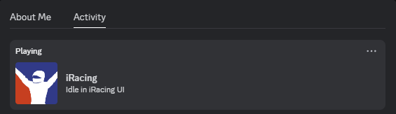
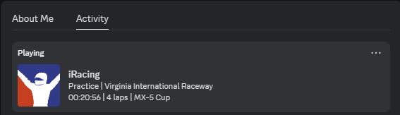
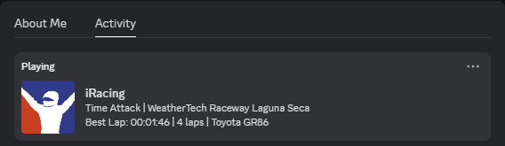

<p align="center">
  
</p>

[](https://github.com/BananaJeanss/iRacingRPC "View GitHub repo")
[](https://opensource.org/licenses/GPL-3.0 "View the license")


# iRacing Rich Presence

Discord Rich Presence for iRacing sessions using python.

## Features

- Display current session, position, laps, current track name and car name.
- User-friendly interface and installation
- Lightweight
- Customizable settings

## Gallery

| Idle | Practice |
| --- | --- |
|  |  |
| Time Attack | Racing |
|  |  |

## Installation

1. Ensure [Python](https://www.python.org/downloads/) 3.12.4 or later is installed.

2. Clone the repository ```git clone https://github.com/BananaJeanss/iRacingRPC```

3. Navigate to the project directory ```cd iRacingRPC```

4. Install the required dependencies ```pip install -r requirements.txt```

5. Make sure everything in settings.json is to your liking.

6. Run the application ```py main.pyw```

If you want to see the console, rename main.pyw to main.py.

## Settings.json

Settings.json has a few settings that you can change to your liking.

- **updateInterval**: The interval in seconds at which the presence updates.
- **displayIdle**: Boolean value to show or hide the idle status.
- **displayGithub**: Boolean value to show or hide the GitHub link in the presence when idle.
- **CustomIdleText**: Text to display when the user is idle.
- **EnableLock**: If set to true, the script will not run again if it's already running.
If psutil is installed, it will check the PID value inside irpc.lock and check if a process with the same PID is already running.
Without psutil, the script will just check if irpc.lock exists.

## Contributing

If you're interested in contributing to this project, we welcome your help! Please refer to the [CONTRIBUTING.md](./CONTRIBUTING.md) file for detailed information on how to get started.

Whether you have ideas for new features or have found a bug that needs fixing, we encourage you to open an issue or submit a pull request. Your contributions are greatly appreciated!

## Acknowledgements

- [pyirsdk](https://github.com/kutu/pyirsdk)

- [pystray](https://github.com/moses-palmer/pystray)

- [pypresence](https://pypi.org/project/pypresence/)

- [Pillow](https://github.com/python-pillow/Pillow)
